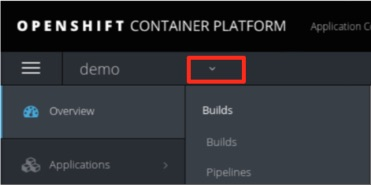
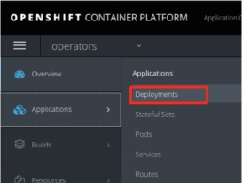
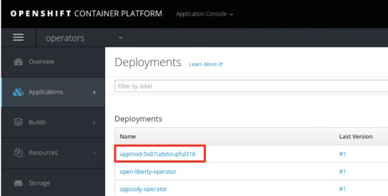
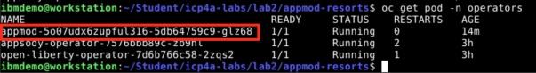
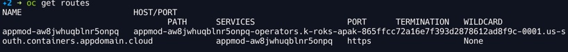

# **IBM Cloud Managed OpenShift - Liberty Operator**

Deploy a Java App to an IBM Cloud Managed OpenShift Cluster with Open Liberty Operator using IBM Cloud Pak for Applications

This demo is adopted from  
<https://bluedemos.com/show/2459>  
to work with ROKS.

On the journey to cloud, enterprise customers are facing challenges moving their existing on-premises applications to cloud quickly and cost-effectively. The IBM Cloud Pak for Applications provides a complete and consistent experience and solution to modernize enterprise applications for cloud-native deployments. Customers can easily modernize their existing applications with IBM’s integrated tools and develop new cloud-native applications faster for deployment on any cloud.One of the solutions included in the Pak is the Open Liberty runtime, a highly composable, fast to start, dynamic application server runtime environment. In this lab, you will learn how to deploy an existing Java application to Open Liberty container running on OpenShift Kubernetes cluster using the Open Liberty Operator. Open Liberty Operator deploys and manages a JavaEE /  MicroProfile / Spring application running on Open Liberty in Kubernetes Cluster.

## Business Scenario
Your company has a web application called Mod Resorts, a WebSphere application showing the weather in various locations. Your company wants to move this application from on-premises to the cloud. 

As a tech lead, you have already analyzed the application using the IBM Transformation Advisor tool.  Based on the analysis you know that you can move this application from the traditional WebSphere Server environment to a light-weighted Open Liberty server environment without any code change **(The Transformation Advisor Analyses Study is covered on a different lab!)**.  Now you are planning to use the Open Liberty Operator to move this application to an Open Liberty instance running on OpenShift Kubernetes cluster. In this lab, you are going to implement this solution. The Mod Resorts application is currently deployed on-premises in the local WebSphere Application Server (WAS). You will create an Open Liberty Docker image with the Mod Resorts application and deploy the Docker container to OpenShift Kubernetes cluster.

## Objective
The objectives of this lab are to:
  
* Have knowledge of Open Liberty Operator  
* Learn how to Create Open Liberty Docker image  
* Learn how to use Open Liberty Operator to deploy the Open Liberty Docker container to OpenShift Kubernetes cluster.  

## Prerequisites
The following prerequisites must be completed prior to beginning this lab:

* An IBM Cloud Managed OpenShift Cluster provisioned with the IBM Cloud Pak for Applications installed


## Lab Tasks
Lab TasksDuring this lab, you will complete the following tasks:  

* build an Open Liberty Docker image.
* push the Open Liberty Docker image to IBM Cloud Container registry.
* deploy the Open Liberty container to IBM Cloud Managed OpenShift using the Open Liberty Operator.
* verify Open Liberty container deployment.
* test and verify the Mod Resorts app on Open Liberty container.
* update the Mod Resorts app deployment configuration.

### Clone the Git Repo
``` 
 github.ibm.com/kevincollins/liberty-operator.git

```

### Build an Open Liberty DockerImage.

The IBM Cloud Pak for Application has a tool called Transformation Advisor, which can be used to analyze your existing java applications and evaluate the efforts to move them to cloud. The analysis study of the Mod Resorts application is covered in lab 1 of this lab series. The analysis report shows that the Mod Resorts application can be directly moved to the Open Liberty server in Docker container without any code change.  In this task, you are going to build an Open Liberty Docker image containing the Mod Resorts application. 

The Dockerfile is the key file you needed to build your Docker image. It defines how the Docker image that has the Mod Resorts application and configuration pre-loaded will be built.

#### Review the Dockerfile file.
Navigate to /appmod-resorts/ directory from the github repository you cloned.

Open dockerfile for reviewing.

```
FROM openliberty/open-liberty:javaee8-ubi-min  
COPY --chown=1001:0 data/examples/modresorts-1.0.war /config/dropins

```
As you can see, the file defines the following activities to create the Open Liberty Docker image:

* Get the base Open Libertyimage from Docker Hub
* Add the app runtime file to the base image

Note: The default Open Liberty server.xml is used without change, because the default server settings meet all the Mod Resorts application needs.

Build the Docker image and publish it to the the IBM Cloud Container Registry by executing the following commands in the terminal window:

```
cd appmod-resorts/

docker build -t us.icr.io/kmcolli/demo/app-modernization:v1.0.0 .

```

where 

* **us.icr.io/kmcolli** is your IBM Cloud Container Registry 
* demo is the name of namespace we are using to host the image.

Note: make sure you have included the “.” (space + period) at the end of your second command.

After the docker container image is created, you can issue the command below to check it:

```
docker images |grep app-modernization

```
You will see your docker image.

#### Push the Open Liberty Docker Image to OpenShift Image Registry

After the Open Liberty Docker image is built, you need to push it to the OpenShift image registry, so you can use it to deploy the Open Libertycontainer to OCP.

From the terminal window, issue the command below to login to the OCP.

#### Login to your managed openshift cluster and setup a secure route to the internal registry
* Log into your IBM Cloud Managed OpenShift Cluster - copy the login command from the Openshift Console
* change to the default project
  
```
oc project default
	
```
* Create a secured route for the docker-registry service that uses reencrypt TLS termination. With re-encryption, the router terminates the TLS connection with a certificate, and then re-encrypts the connection to the internal registry with a different certificate. With this approach, the full path of the connection between the user and the internal registry is encrypted.

```
oc create route reencrypt --service=docker-registry
```
	
* Retrieve the hostname (HOST/PORT) and the PORT that were assigned to the docker-registry route.

```
oc get route docker-registry
	
```
	
Example output:
   
```
NAME              HOST/PORT                                                                                                 
docker-registry   docker-registry-default.<cluster_name>-<ID_string>.<region>.containers.appdomain.cloud             
   
```
 
Copy the host to login into docker
	
```
docker login -u $(oc whoami) -p $(oc whoami -t) docker-registry-default.k-roks-apak-865ffcc72a16e7f393d2878612ad8f9c-0001.us-south.containers.appdomain.cloud
	
```

* Execute the following commands to push your docker image to IBM Cloud Private image repository.

```
docker tag app-modernization:v1.0.0 docker-registry-default.k-roks-apak-865ffcc72a16e7f393d2878612ad8f9c-0001.us-south.containers.appdomain.cloud/demo/app-modernization:v1.0.0

docker push docker-registry-default.k-roks-apak-865ffcc72a16e7f393d2878612ad8f9c-0001.us-south.containers.appdomain.cloud/demo/app-modernization:v1.0.0
	
```

* Verify the image is added to the OpenShift image stream
	
```
oc get imagestream
	
```
	
## Deploy the Open Liberty operator.
  
You are going to use the OpenShift CLI commandsto deploy the Open Libertycontainer.
  
* From the terminal window, issue the following command to add the Open Liberty operator security context constraints to the operators namespace where you are going to deploy the application to:

Create a new operators project
	
```
oc create ns operators
	
```
	
Install Operator artifacts  
  	
   
```
git clone https://github.com/OpenLiberty/open-liberty-operator.git 
cd open-liberty-operator
kubectl apply -f olm/open-liberty-crd.yaml
kubectl apply -f deploy/service_account.yaml
kubectl apply -f deploy/role.yaml
kubectl apply -f deploy/role_binding.yaml
kubectl apply -f deploy/operator.yaml
	
```  

Install security and set image pull policy for the operators namespace:

```
kubectl apply -f deploy/ibm-open-liberty-scc.yaml --validate=false
oc adm policy add-scc-to-group ibm-open-liberty-scc system:serviceaccounts:operators
	
```  
	

Note: you will need to install the open liberty operator for each namespace you want to deploy an open liberty operator to. 
  	
 	
##Deploy the Open Liberty Container to OpenShift using the Open Liberty Operator
Review the deployment YAML file.
	
	
Navigate to the github repo you previously cloned.
Open and review appmod-resorts/deploy/apps/appmod/v1.0.0/app-mod_cr.yaml
	
```
apiVersion: openliberty.io/v1alpha1
kind: OpenLiberty
metadata:
  name: appmod
spec:
  image:
    repository: docker-registry.default.svc:5000/demo/app-modernization
    tag: v1.0.0
    pullPolicy: IfNotPresent
  replicaCount: 1
  
 ```
  
Deploy the Open Liberty Docker container to OpenShift Kubernetes cluster with the command:
  
```
oc apply -f deploy/apps/appmod/v1.0.0/app-mod_cr.yaml -n operators
```
  
The Open Liberty container is deployed to OpenShift Kubernetes cluster operators namespace.
  
  
  
### Verify the Open Liberty Container Deployment
  
After the Open Liberty container is deployed, you can go to the OCP console to take a look at the deployment details.
  
Go back to the OCP console window, click the project dropdown menu and select the operators project.
  

  
From the operators project, select Deployments from the Applications list.
  

  
You can see that your application is in the deployment list.

  


From the terminal window, issue the command:
  
```
oc get pod -n operators
```
  You will see that your application pod is in running status.
    ''
  
  Execute the following command to get the NodePort of the pod:
  
  ```
  oc get svc -n operators
  
  ```
  As you can see the NodePort of the pod is 32604 in the screenshot. Yours might be different.
  
  ''
  
  create a route to service
  
  ```
  oc expose service appmod-aw8jwhuqblnr5onpq
  
  ```
  
  Note: use the service name *appmod-aw8jwhuqblnr5onpq* you got from the previous stop  
   
  
  Now you can launch the application from a new browser window.  Type the application URL as 
  
  url you got from the route you created:NodePort/resorts
  
  for example: 
   
 		https://appmod-aw8jwhuqblnr5onpq-operators.k-roks-apak-865ffcc72a16e7f393d2878612ad8f9c-0001.us-south.containers.appdomain.cloud:32604/resorts/
  
  and press Enter. 
  
  If you see the message “Warning: Potential Security Risk Ahead”, click Advanced>Accept the Risk and Continue to continue.
  
  The app home page will be displayed. Click WHERE TO? to view city list.
     
    
  Click LAS VEGAS, USA from the listandit will show the weather of the city.
  
  
  ### Update the Open Liberty Container Deployment
  
  In the task, you are going to make a change to the deployment YAML file, add one more replica to the pod and re-deploy the application. You will see the deployment would update itself automatically to have 2 replicas.
  
  #### Edit the deployment YAML file.
  * Navigate to the appmod-resorts/deploy/apps/appmod/v1.0.0/ directory.
  * Open app-mod_cr.yaml for editing.
  * Change the replicaCount from 1 to 2 and save.

   ```
   apiVersion: openliberty.io/v1alpha1
   kind: OpenLiberty
   metadata:
     name: appmod
   spec:
     image:
       repository: docker-registry.default.svc:5000/demo/app-modernization
       tag: v1.0.0
       pullPolicy: IfNotPresent
     replicaCount: 2
 	
 	```
 	
 	From the terminal window, deploy the Docker container with command:
 	
 	```
 	oc apply -f deploy/apps/appmod/v1.0.0/app-mod_cr.yaml -n operators
 	
 	```
 	
 	Once deployed, issue the following command:
 	
 	```
 	oc get pod -n operators| grep appmod
 	
 	```
 	
 	You will see that your application pod has two instances running.
		

## Summary
In this lab, you have learned how to use Open Liberty Operator to deploy your applications to IBM Cloud. As a part of IBM App Modernization solutions in IBM Cloud Pak for Application, the Open Liberty Operator helps users effectively deploying and managing applications running on Open Liberty containers to a Kubernetes cluster. To learn more about IBM App Modernization solutions, please visit Cloud Pak for Applications.

**Congratulations! You have successfully completed the lab “Deploy a Java App to Kubernetes Cluster with Open Liberty Operator on IBM Cloud Managed OpenShift”**
